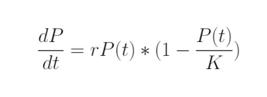
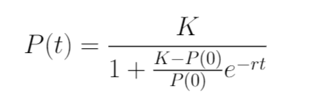
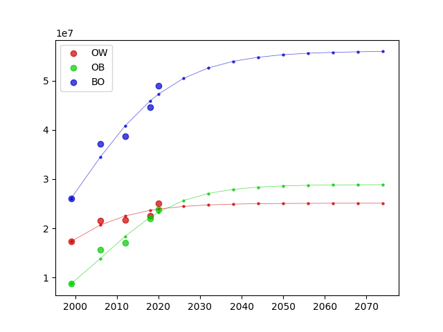

# Affiliation

Final Project for the Dynamic Systems 2022-2 class, taught by Dr. Victor de la Luz at the _Universidad Nacional Autónoma de México_ (National Autonomous University of México | UNAM), in its _Escuela Nacional de Estudios Superiores Unidad Morelia_ Campus (National School of Superior-Level Studies, _Morelia_ Campus | ENES Morelia), as part of its _Licenciatura en Tecnologías para la Información en Ciencias_ career plan (Bs. in Information Technologies applied to Science | L.T.I.C.).

> Alexis Hassiel Nuviedo Arriaga ([@nuviedo](https://github.com/nuviedo))
> 
> Miriam Guadalupe Valdéz ([@mirluvams](https://github.com/mirluvams))
> 
> Sofía García de la Rosa ([@SofiaDeLaRosa](https://github.com/SofiaDeLaRosa))

# Introduction
The following project documents the practical application of several methods of dynamic systems to obtain and represent an accurate prediction of the population with either overweight or obesity found in México, through the analysis of results from the [_Instituto Nacional de Salud Pública_](https://insp.mx/) (National Public Health Institute | INSP) by making use of their various census reports through the _ENSANUT_ Project to obtain the initial conditions required for said systems, through the usage of regression & extrapolation in several capacities be it linear polynomial or exponential, all the while making use of modern data science libraries.

According to the WHO, overweight and obesity are defined as abnormal or excessive fat accumulation that presents a risk to health. A body mass index (BMI) over 25 is considered overweight, and over 30 is obese. This is a known prevalent issue in several countries, as it was not long ago that México held the world's first place at the obesity ranking for the underage population.

The need for such a project stems from a simple hypothesis: given that the population that presents some kind of overweight or obesity is in and of itself a population, it is not too far a stretch to assume said population may follow a classical linear/exponential growth scenario. It is important to mention that gathering an accurate method of prediction for population under such conditions could help the relevant authorities improve their current health plans, comparing their expected results to our predicted models.

# General Objective
The expected output of this project is a set of graphs which predict, in the broadest terms, how the population with either of the aforementioned conditions can plausibly evolve, once iterated enough.
Said graphs are to be obtained through the use of concise graphing APIs, showcasing both the model being presented and the calculated precision by using an appropriate correlation coefficient between the estimated and known data, such that we can compare our approaches with eachother. It should be noted that the amount of data we can gather is considerably small, so it is expected we will not have real data to compare against that is not already present in the initial conditions.

# Toolset
The project is expected to be developed making use of several python 3.10+ libraries, such as the following:

* NumPy: [https://numpy.org/] 
* pandas: [https://pandas.pydata.org/]
* seaborn: [http://seaborn.pydata.org/]
* scipy: [https://scipy.org/]

# Methodology
We hypothesize the population with obesity & overweight follow a simple population growth scenario described by the dynamic system following the equation

Where t is the time since a base point, r is a relative growth coefficient, and K is the capacity of the population.
Due to it being a separable differential equation, it can be solved to result in the following expression for P(t)

Once separated, the dynamic system can be fitted accordingly with our data, as obtained in the data source described above. This was achieved by making use of scipy's implementation of Levenberg-Marquard minimization.

# Usage Instructions & Requirements
Execute [WEIGHTSM.py](WEIGHTSM.py) in a system with the following packages:
* [numpy](https://numpy.org/)
* [matplotlib](https://matplotlib.org/)
* [scipy](https://scipy.org/)

# Results
Using L-M minimization, it was found that the equation fits best given the following parameters:

For overweight: 
r=0.10457, K=25105894.30522

For obesity: 
r=0.10763, K=28892092.21548

For overweight & obesity: 
r=0.08692, K=56037606.60947

Given our objective, we predict that by 2026, the population with overweight, yet not obesity, will increase to 24,453,241, from the 23,910,745 recorded in 2020. 

Likewise, we predict the amount of people presenting obesity will increase from 2020's 23,267,462 to 25,642,393 by 2026.

Therefore, the amount of people with either of such disorders will increase to a total of 50,471,689, from 2020's 47,258,452. 

It is notable that out models seem to converge into attractor points by the year 2050.

# Conclusions
Firstly, we conclude that more research is necessary as to whether the model is accurate, for which we need more data, for which we need to wait for more official data sets.

Assuming that the model is accurate, it would imply that, if the amount of people in the country eventually stabilizes into a given value, so would the population that presents either obesity or overweight under the current conditions.

# References
Pública, I. N., & Salud, S. d. (2021). Encuesta Nacional de Salud y Nutrición 2020 sobre Covid-2019. México.
[https://ensanut.insp.mx/encuestas/ensanutcontinua2020/doctos/informes/ensanutCovid19ResultadosNacionales.pdf]

Stewart, James; Clegg, Daniel (2012). Brief Applied Calculus. Brooks/Cole Cengage Learning.

